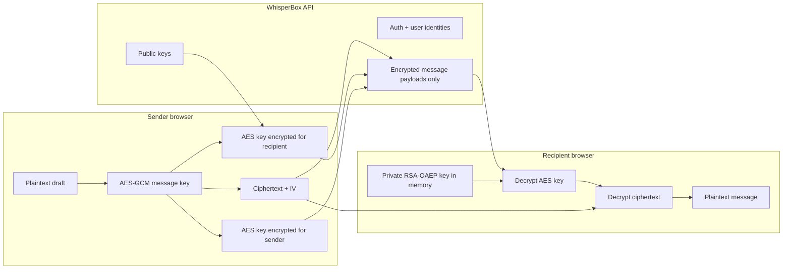

# WhisperBox E2EE Client

WhisperBox is a secure messaging client for the hosted WhisperBox backend at
`https://whisperbox.koyeb.app`. The app uses client-side hybrid encryption:
messages become ciphertext before any request leaves the browser, and the
backend stores only encrypted blobs.

The interface is inspired by Instagram Direct: a left conversation rail, compact
profile rows, rounded message bubbles, a search-first flow, and a mobile layout
that feels like a familiar messaging app while remaining branded as WhisperBox.
Styling uses Tailwind CSS v4 through the official Vite plugin, with no competing
component stylesheet overriding Tailwind utilities.

## What The App Does

- Creates accounts against the shared WhisperBox backend.
- Generates RSA-OAEP keys in the browser before registration.
- Stores public keys on the backend.
- Keeps raw private keys off the backend.
- Wraps private keys with a password-derived AES-KW key.
- Searches real backend users by username.
- Sends encrypted direct messages over WebSocket when available.
- Falls back to `POST /messages` when realtime delivery is unavailable.
- Decrypts incoming and sent-message history locally.
- Shows clear failure states when network requests or decryption fail.

## Run Locally

```bash
npm install
npm run dev
```

Build for production:

```bash
npm run build
```

The local app runs at:

```text
http://127.0.0.1:5173
```

## How To Test Messaging

The app does not use localStorage as a fake user database. Users are created on
the live backend at `https://whisperbox.koyeb.app`, so deployed copies of this
frontend share the same user pool.

1. Open the app in one browser profile.
2. Create account A with a username such as `alice_test_01`.
3. Open the app in another browser profile, another browser, or an incognito
   window.
4. Create account B with a username such as `bob_test_01`.
5. Return to account A.
6. Use the dashboard search field to search for `bob_test_01`.
7. Select Bob from the search result.
8. Type a message in the composer and send it.
9. Log in as Bob to load and decrypt the message.

Usernames are not email addresses. They must be 3-32 lowercase letters, numbers,
underscores, or hyphens. Examples:

```text
godwin_goje
alice_test
bob-2026
```

## UI Notes

The auth screens and dashboard use the same bright WhisperBox visual language:
colorful icons, a clear search-first messaging flow, and compact chat bubbles.
Message bubbles intentionally do not show a repeated `encrypted` label; the
encryption status lives in the chat header and empty states so the conversation
itself stays readable.

## Tailwind Setup

Tailwind is installed with the current Vite integration recommended by the
official Tailwind docs:

- `tailwindcss`
- `@tailwindcss/vite`

`vite.config.ts` registers `tailwindcss()` next to the React plugin.
`src/index.css` intentionally contains only:

```css
@import "tailwindcss";
```

All interface styling lives in React `className` utilities so Tailwind remains
the single styling system.

## Architecture Diagram



## Encryption Flow

Registration starts in the browser. The client creates a 2048-bit RSA-OAEP
keypair, creates a random PBKDF2 salt, derives an AES-KW wrapping key from the
user's password, exports and pads the private RSA key to satisfy AES-KW's 8-byte
block requirement, wraps that padded private-key carrier, and sends only the
public key, wrapped private key, salt, username, display name, and password to
the backend. The raw private key never leaves the device.

Login restores the same cryptographic session. The backend returns the wrapped
private key and PBKDF2 salt. The user password derives the AES-KW wrapping key
again, then the client unwraps the RSA private key into memory. If unwrapping
fails, messages remain locked.

Sending uses hybrid encryption. The browser generates a fresh 256-bit AES-GCM
key and 96-bit IV, encrypts the message text with AES-GCM, encrypts that AES key
with the recipient's RSA-OAEP public key, and also encrypts it with the sender's
own public key so sent messages can be read later. The API receives only
`ciphertext`, `iv`, `encryptedKey`, and `encryptedKeyForSelf`.

Receiving reverses the flow. If the current user received the message, the
client decrypts `encryptedKey`; if the current user sent it, the client decrypts
`encryptedKeyForSelf`. That recovered AES-GCM key decrypts the ciphertext.
Failures render as "Unable to decrypt message" instead of crashing the thread.

## Key Management

The private RSA key is stored in two states only:

- Wrapped form: encrypted with AES-KW and safe to send to the backend as a blob.
- Runtime form: a non-extractable `CryptoKey` held in memory after login.

The app persists session metadata in IndexedDB, including the access token,
refresh token, user profile, public key, wrapped private key, and PBKDF2 salt.
It does not persist plaintext private keys, passwords, or plaintext messages.

## Security Trade-Offs

- The backend can see metadata such as usernames, sender IDs, recipient IDs, and
  timestamps.
- Refresh tokens are persisted in IndexedDB for usability. A hardened production
  app should prefer secure, httpOnly cookie flows when the backend supports them.
- RSA-OAEP keypairs are long-lived, so this implementation does not provide full
  forward secrecy. A future version could add ephemeral ECDH ratchets.
- Password reset cannot recover old messages unless a separate recovery-key
  design is introduced.
- HTTPS is required because Web Crypto and secure transport both matter.

## Validation Checklist

- Register generates keys client-side before calling `/auth/register`.
- Login unwraps the private key with the password-derived wrapping key.
- User search calls `/users/search`.
- Sending fetches the recipient public key before encryption.
- The server receives encrypted message payloads only.
- History decrypts recipient and sender key slots correctly.
- WebSocket close code `4001` refreshes the token and reconnects.
- WebSocket close code `4003` clears the session and returns to login.
- Decryption failures are visible, contained UI states.
- Build verification passes with `npm run build`.
- Lint verification passes with `npm run lint`.

## Documentation

The detailed implementation walkthrough is in:

```text
docs/code-walkthrough.md
```

It explains the mental model, data flow, crypto layer, API layer, WebSocket
handling, IndexedDB session storage, Tailwind UI, toast behavior, and the
message bubble decisions in depth.

## Async Functions In This Project

JavaScript asynchronous programming lets the app start work that may finish
later, such as key generation, IndexedDB access, network requests, token
refresh, or message decryption, without freezing the UI.

In this project, an `async` function is used when a task returns a `Promise` and
the next line of code should wait for that task's result.

Example from the registration crypto flow:

```ts
export async function createRegistrationKeyBundle(
  password: string,
): Promise<RegistrationKeyBundle> {
  const pair = await crypto.subtle.generateKey(RSA_PARAMS, true, [
    "encrypt",
    "decrypt",
  ]);
  const salt = crypto.getRandomValues(new Uint8Array(new ArrayBuffer(16)));
  const wrappingKey = await deriveWrappingKey(password, salt);
  const publicKey = await exportPublicKey(pair.publicKey);
  const wrappedPrivateKey = await wrapPrivateKey(pair.privateKey, wrappingKey);

  return {
    publicKey,
    wrappedPrivateKey: bytesToBase64(wrappedPrivateKey),
    pbkdf2Salt: bytesToBase64(salt),
    privateKey: pair.privateKey,
  };
}
```

Why this function is `async`:

- `crypto.subtle.generateKey(...)` is asynchronous because browser cryptography
  can take time and should not block rendering.
- `deriveWrappingKey(...)` is asynchronous because PBKDF2 performs many hashing
  rounds.
- `exportPublicKey(...)` is asynchronous because Web Crypto exports key material
  through Promise-based APIs.
- `wrapPrivateKey(...)` is asynchronous because it exports, pads, imports, and
  wraps private-key bytes with Web Crypto.

`await` means "pause this async function until the Promise resolves." It does
not freeze the whole app. While the function is waiting, the browser can still
render, respond to clicks, and keep the page alive.

The registration flow needs this ordering:

```text
generate RSA keys
  -> create salt
  -> derive wrapping key
  -> export public key
  -> wrap private key
  -> return registration bundle
```

Without `await`, the app would try to use unfinished Promise objects instead of
real keys and encrypted blobs.

Async functions are also used in the API layer:

```ts
async function request<T = unknown>(
  path: string,
  options: RequestOptions = {},
): Promise<T> {
  let response: Response;

  try {
    response = await fetch(`${API_BASE_URL}${path}`, {
      ...options,
      headers,
      body: options.body === undefined ? undefined : JSON.stringify(options.body),
    });
  } catch {
    throw new Error(
      "WhisperBox cannot reach the secure messaging server. Check your internet connection, refresh the page, and try again.",
    );
  }

  if (!response.ok) {
    throw new Error(await errorMessage(response));
  }

  return response.json() as Promise<T>;
}
```

Why this request helper is `async`:

- `fetch(...)` is asynchronous because HTTP requests take time.
- `await fetch(...)` waits for the server response.
- `try/catch` catches browser-level network failures, such as being offline or
  the request not reaching the API.
- `response.ok` checks whether the backend returned a successful HTTP status.
- `await errorMessage(response)` reads backend validation errors when the status
  is not successful.
- `response.json()` parses the successful JSON response.

The app uses async functions in these important places:

- Registration: generate keys, derive wrapping key, wrap private key, call
  `/auth/register`.
- Login: call `/auth/login`, unwrap private key, save the session.
- Message sending: fetch recipient public key, encrypt message payload, send by
  WebSocket or HTTP fallback.
- Message loading: fetch encrypted history, decrypt every message locally.
- Token refresh: call `/auth/refresh` before the access token expires.
- IndexedDB storage: save, load, and clear session metadata.
- WebSocket recovery: refresh token and reconnect after close code `4001`.

Short mental model:

```text
async = this function does work that may finish later
await = wait for this Promise before continuing this function
fetch = make an HTTP request
try/catch = handle failures without crashing the UI
```

In an E2EE app, async code is especially important because both security work
and network work are naturally asynchronous. Key generation, key wrapping,
message encryption, message decryption, and backend communication must happen in
the right order while the UI remains responsive.

## Commit Convention

This repository uses Conventional Commits:

```text
<type>(<scope>): <subject>

<body>

<footer>
```

Subjects use imperative mood, lowercase first letters, and no trailing period.
Examples:

```text
feat(e2ee): add encrypted messaging client
docs(walkthrough): explain client encryption flow
security(crypto): wrap private keys with password-derived key
```
