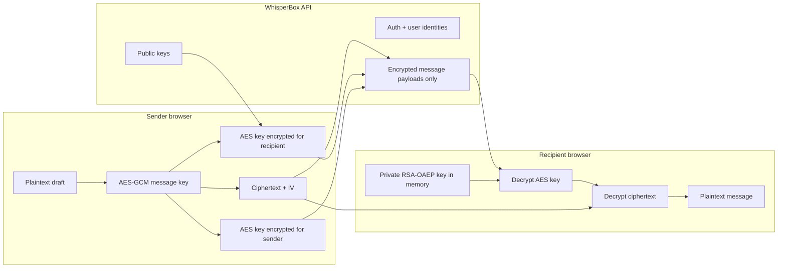

# WhisperBox E2EE Client

WhisperBox is a secure messaging client for the hosted WhisperBox backend at
`https://whisperbox.koyeb.app`. The app uses client-side hybrid encryption:
messages become ciphertext before any request leaves the browser, and the
backend stores only encrypted blobs.

The interface is inspired by Instagram Direct: a left conversation rail, compact
profile rows, rounded message bubbles, a search-first flow, and a mobile layout
that feels like a familiar messaging app while remaining branded as WhisperBox.
Styling uses Tailwind CSS v4 through the official Vite plugin, with no competing
component stylesheet overriding Tailwind utilities.

## Run Locally

```bash
npm install
npm run dev
```

Build for production:

```bash
npm run build
```

## Tailwind Setup

Tailwind is installed with the current Vite integration recommended by the
official Tailwind docs:

- `tailwindcss`
- `@tailwindcss/vite`

`vite.config.ts` registers `tailwindcss()` next to the React plugin.
`src/index.css` intentionally contains only:

```css
@import "tailwindcss";
```

All interface styling lives in React `className` utilities so Tailwind remains
the single styling system.

## Architecture Diagram



## Encryption Flow

Registration starts in the browser. The client creates a 2048-bit RSA-OAEP
keypair, creates a random PBKDF2 salt, derives an AES-KW wrapping key from the
user's password, wraps the private RSA key, and sends only the public key,
wrapped private key, salt, username, display name, and password to the backend.
The raw private key never leaves the device.

Login restores the same cryptographic session. The backend returns the wrapped
private key and PBKDF2 salt. The user password derives the AES-KW wrapping key
again, then the client unwraps the RSA private key into memory. If unwrapping
fails, messages remain locked.

Sending uses hybrid encryption. The browser generates a fresh 256-bit AES-GCM
key and 96-bit IV, encrypts the message text with AES-GCM, encrypts that AES key
with the recipient's RSA-OAEP public key, and also encrypts it with the sender's
own public key so sent messages can be read later. The API receives only
`ciphertext`, `iv`, `encryptedKey`, and `encryptedKeyForSelf`.

Receiving reverses the flow. If the current user received the message, the
client decrypts `encryptedKey`; if the current user sent it, the client decrypts
`encryptedKeyForSelf`. That recovered AES-GCM key decrypts the ciphertext.
Failures render as "Unable to decrypt message" instead of crashing the thread.

## Key Management

The private RSA key is stored in two states only:

- Wrapped form: encrypted with AES-KW and safe to send to the backend as a blob.
- Runtime form: a non-extractable `CryptoKey` held in memory after login.

The app persists session metadata in IndexedDB, including the access token,
refresh token, user profile, public key, wrapped private key, and PBKDF2 salt.
It does not persist plaintext private keys, passwords, or plaintext messages.

## Security Trade-Offs

- The backend can see metadata such as usernames, sender IDs, recipient IDs, and
  timestamps.
- Refresh tokens are persisted in IndexedDB for usability. A hardened production
  app should prefer secure, httpOnly cookie flows when the backend supports them.
- RSA-OAEP keypairs are long-lived, so this implementation does not provide full
  forward secrecy. A future version could add ephemeral ECDH ratchets.
- Password reset cannot recover old messages unless a separate recovery-key
  design is introduced.
- HTTPS is required because Web Crypto and secure transport both matter.

## Validation Checklist

- Register generates keys client-side before calling `/auth/register`.
- Login unwraps the private key with the password-derived wrapping key.
- User search calls `/users/search`.
- Sending fetches the recipient public key before encryption.
- The server receives encrypted message payloads only.
- History decrypts recipient and sender key slots correctly.
- WebSocket close code `4001` refreshes the token and reconnects.
- WebSocket close code `4003` clears the session and returns to login.
- Decryption failures are visible, contained UI states.

## Commit Convention

This repository uses Conventional Commits:

```text
<type>(<scope>): <subject>

<body>

<footer>
```

Subjects use imperative mood, lowercase first letters, and no trailing period.
Examples:

```text
feat(e2ee): add encrypted messaging client
docs(walkthrough): explain client encryption flow
security(crypto): wrap private keys with password-derived key
```
